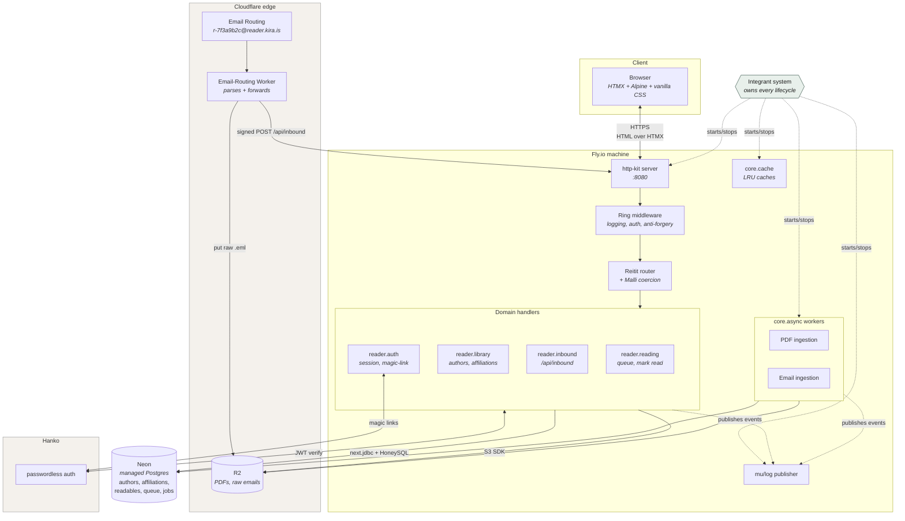
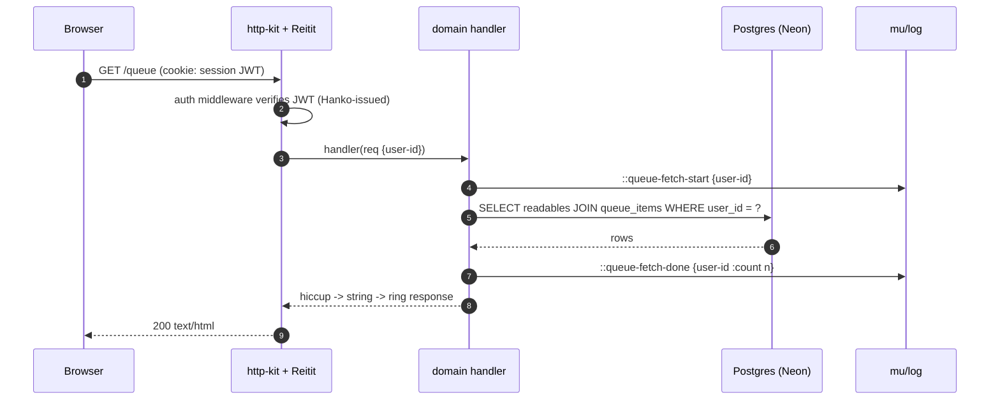
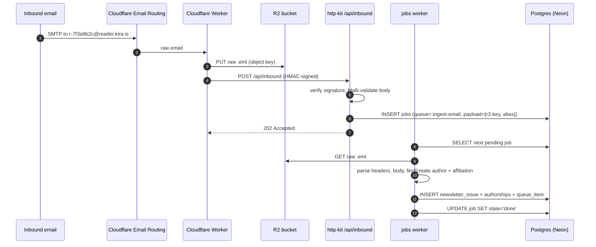
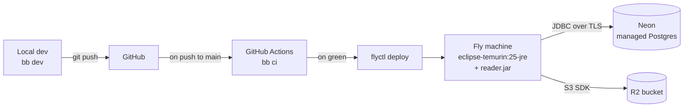

# Architecture

A snapshot of how Reader is wired together as of the v0.1 scaffold.
This is a "where are the boxes and what flows between them" view — the
data-model document covers the shape of state at rest, and the ADRs
cover *why* each piece is the way it is.

## System diagram

## Boundaries and trust

The system has three trust boundaries:

| From                    | To       | What crosses                            | Validated by                              |
| ----------------------- | -------- | --------------------------------------- | ----------------------------------------- |
| Browser                 | http-kit | HTTP requests                           | Malli coercion at the route               |
| Cloudflare Email Worker | http-kit | Inbound email payloads (`/api/inbound`) | Shared-secret signature + Malli on body   |
| Hanko                   | http-kit | JWT in session cookie                   | Hanko-issued JWT verification             |

Inside the Fly machine, everything is first-party code. The
"core/shell" discipline (pure logic vs. effectful edges) is an
organizing principle within the codebase, not a runtime boundary.

## Stateful components owned by Integrant

Every cell in this table has a `defmethod ig/init-key` and a
matching `defmethod ig/halt-key!`. Each is configured once at startup
and passed to its consumers — none of these are looked up globally
at use-time.

| Component                                    | Owns                                                |
| -------------------------------------------- | --------------------------------------------------- |
| `:reader.log/publisher`                      | the mu/log publisher                                |
| `:reader.concerns/http-kit`                  | the http-kit server (port, host, lifecycle)         |
| `:reader.concerns.reitit/ring-handler`       | the assembled Ring handler                          |
| `:reader.concerns.reitit/router`             | the Reitit router, with routes data from EDN        |
| `:reader.concerns.reitit/default-handler`    | unmatched-route handling (404/405/trailing-slash)   |
| `:reader.handlers/home`                      | `GET /` — landing page                              |
| `:reader.handlers/health`                    | `GET /health` — liveness probe                      |
| `:reader.handlers/static`                    | `GET /static/*` — classpath resource handler        |
| `:reader.db/datasource` *(soon)*             | the Postgres connection pool (Neon)                 |
| `:reader.db/migrator` *(soon)*               | Migratus runner, runs once at startup               |
| `:reader.storage/r2` *(soon)*                | the S3 SDK client wired to R2                       |
| `:reader.cache/lru` *(soon)*                 | a named core.cache instance                         |
| `:reader.jobs/worker` *(soon)*               | a core.async loop draining the `jobs` table         |
| `:reader.inbound/parser` *(soon)*            | email parsing pipeline                              |

`concerns/` (server, router, default-handler) cover library-specific glue code,
and `handlers/` (one ig key per route handler) are our app/domain-specific code.
Routes data lives in EDN — each leaf is an `#ig/ref` to a handler key, adding a
route is a config change plus a handler init-key, not a router edit.

## Request lifecycle: typical page render

## Request lifecycle: inbound email

## Deployment topology

Every step is invocable as `bb <task>` locally; CI is a thin shim.
