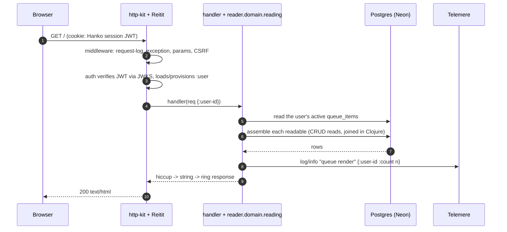
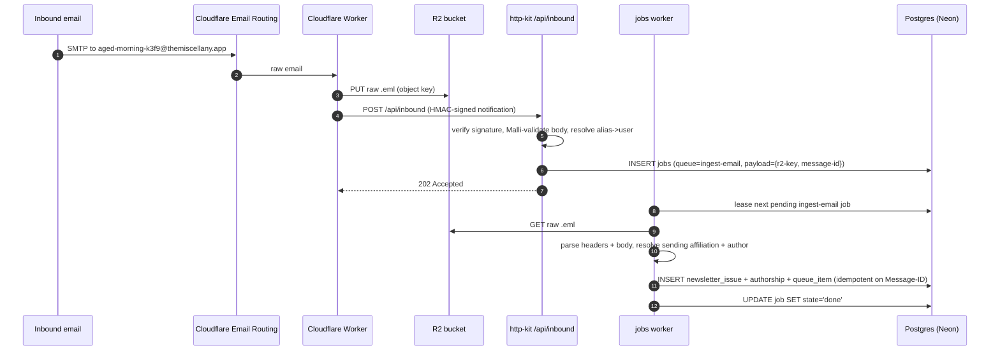
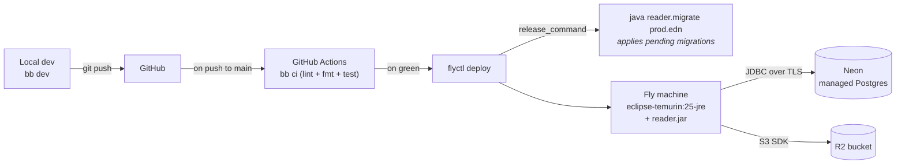

# Architecture

A "where are the boxes and what flows between them" view of Reader as it
runs today. The data-model document covers the shape of state at rest, and
the ADRs cover *why* each piece is the way it is.

Reader is a server-rendered, multi-user reading app: paste a URL or a paper
(arXiv/DOI), or forward a newsletter to your private alias, and it lands in
your queue as a uniform "readable" you read in a distraction-free view.

## System diagram

```mermaid
flowchart TB
  subgraph clientZone["Client"]
    browser["Browser<br/><i>server-rendered HTML + HTMX, vanilla CSS</i>"]
  end

  subgraph cloudflare["Cloudflare edge"]
    emailrt["Email Routing<br/><i>aged-morning-k3f9@themiscellany.app</i>"]
    worker["Email-Routing Worker<br/><i>stores .eml, signs + forwards</i>"]
    r2[("R2<br/><i>raw .eml blobs</i>")]
  end

  subgraph fly["Fly.io machine"]
    direction TB
    httpkit["http-kit server<br/><i>:8080</i>"]
    reitit["Reitit router<br/><i>+ Malli coercion</i>"]
    mw["Ring middleware<br/><i>request-log · exception · params · CSRF · auth</i>"]

    subgraph handlers["reader.handlers.* (HTTP glue)"]
      direction TB
      pages["queue · reader · authors · affiliations · articles · settings · admin"]
      inboundh["/api/inbound"]
      authh["/login · /logout"]
    end

    domain["reader.domain.*<br/><i>articles, authors, affiliations,<br/>readables, reading, users, …</i>"]

    subgraph features["ingestion features"]
      ingest["reader.ingest<br/><i>URL + email</i>"]
      papers["reader.papers<br/><i>arXiv / OpenAlex</i>"]
      tagf["reader.ingest.tag<br/><i>auto-tag + embed</i>"]
    end

    worker2["reader.jobs/worker<br/><i>single thread, drains jobs table</i>"]
    telemere["Telemere<br/><i>tools.logging + SLF4J backend</i>"]

    httpkit --> mw --> reitit --> handlers
    handlers --> domain
    worker2 --> features --> domain
  end

  neon[("Neon<br/><i>managed Postgres</i><br/>authors, affiliations, readables,<br/>queue_items, jobs, inboxes")]

  subgraph hanko["Hanko Cloud"]
    hk["passwordless auth<br/><i>issues session JWT</i>"]
  end

  ig{{"Integrant system<br/><i>owns every lifecycle</i>"}}

  modelapi[("Model API<br/><i>LLM + embeddings<br/>OpenAI-compatible</i>")]

  browser <-->|HTTPS<br/>HTML over HTMX| httpkit
  emailrt --> worker
  worker -->|put raw .eml| r2
  worker -->|signed POST /api/inbound| httpkit

  domain -->|next.jdbc + HoneySQL| neon
  worker2 -->|next.jdbc| neon
  worker2 -->|S3 SDK: GET .eml| r2
  tagf -->|POST /chat,/embeddings| modelapi
  mw <-->|verify JWT via JWKS| hk
  authh <-->|login element| hk

  handlers -.logs via tools.logging.-> telemere
  worker2 -.logs.-> telemere

  ig -.starts/stops.-> httpkit
  ig -.starts/stops.-> worker2
  ig -.starts/stops.-> telemere

  classDef ext fill:#f4f1ec,stroke:#999,color:#333
  classDef ig fill:#e8f0eb,stroke:#2b4a3f,color:#1a1a1a
  class cloudflare,hanko,modelapi ext
  class ig ig
```

## Boundaries and trust

The system has three trust boundaries:

| From                    | To       | What crosses                            | Validated by                            |
| ----------------------- | -------- | --------------------------------------- | --------------------------------------- |
| Browser                 | http-kit | HTTP requests                           | Malli coercion + CSRF origin check      |
| Cloudflare Email Worker | http-kit | Inbound email payloads (`/api/inbound`) | Shared-secret HMAC signature + Malli     |
| Hanko                   | http-kit | JWT in session cookie                   | Hanko-issued JWT, verified against JWKS  |

Inside the Fly machine, everything is first-party code. The "core/shell"
discipline (pure logic vs. effectful edges) is an organizing principle within
the codebase, not a runtime boundary.

## Codebase layout

`src/reader/` is organized by layer. A facade namespace (`foo.clj`) exposes the
public API and its `foo/` directory holds the internals — `ingest`, `papers`,
`jobs`, `db`, `storage`, and `auth` all follow this shape.

| Namespace                | Role                                                             |
| ------------------------ | --------------------------------------------------------------- |
| `reader.main` / `.migrate` | Entry points — boot the Integrant system / run migrations       |
| `reader.concerns.*`      | Library glue: Integrant readers, reitit router, http-kit server |
| `reader.web.*`           | Request/response helpers, the middleware components, CSRF, HMAC  |
| `reader.handlers.*`      | HTTP glue — one ns per resource, parses request → calls domain   |
| `reader.ui.*`            | Hiccup components + per-page renderers                           |
| `reader.domain.*`        | Per-entity domain logic (articles, authors, affiliations, authorships, newsletters, users, inboxes, readables, reading, tags) |
| `reader.ingest` (+`.*`)  | Manual-URL + newsletter ingestion; the `tag-readable` auto-tagging job (`.tag` abstraction, `.tag-job` orchestrator) |
| `reader.papers` (+`.*`)  | arXiv/DOI paper ingestion (OpenAlex graph + arXiv HTML)          |
| `reader.ai`              | Pluggable OpenAI-compatible model clients — completion + embeddings |
| `reader.jobs` (+`.worker`) | Durable job queue table + the polling worker                   |
| `reader.db.*`            | HikariCP datasource, Migratus migrator, CRUD + JDBC type glue    |
| `reader.storage.*`       | The `Blobs` blob-storage abstraction (memory / file / R2)        |
| `reader.auth` (+`.middleware`) | Hanko JWT verification + the auth gate                     |
| `reader.util.*`          | Pure stdlib helpers (`slug`, `url`)                              |
| `reader.extract`         | Assembles a stored readable into the uniform reader-view content |
| `reader.inbound`         | Inbound-email webhook contract + enqueue (no HTTP)               |
| `reader.admin`           | Read-only aggregations for the extraction eval dashboard         |
| `reader.http`            | Outbound HTTP client for fixed-host APIs (OpenAlex, arXiv)       |

## Stateful components owned by Integrant

Every component below has a `defmethod ig/init-key` and a matching
`defmethod ig/halt-key!`. Each is configured once at startup and passed to its
consumers — none are looked up globally at use-time. The wiring lives in
`resources/base-system.edn`, with per-environment overrides in
`env/{dev,test,prod}/resources/`.

| Component                                 | Owns                                                              |
| ----------------------------------------- | ----------------------------------------------------------------- |
| `:reader.log/publisher`                   | Telemere as the `tools.logging`/SLF4J backend (JSON prod, pretty dev) |
| `:reader.web.middleware/*`                | The middleware stack: request-log, exception, parameters          |
| `:reader.web/csrf`                        | Origin/Referer CSRF gate (inert until `:site-origin` is set)      |
| `:reader.auth/middleware`                 | Hanko JWT verification + invite-gated user provisioning           |
| `:reader.concerns.reitit/router`          | The Reitit router; routes data + middleware come from EDN         |
| `:reader.concerns.reitit/default-handler` | Unmatched-route handling (404/405/trailing-slash redirect)        |
| `:reader.concerns.reitit/ring-handler`    | The assembled Ring handler                                        |
| `:reader.concerns/http-kit`               | The http-kit server (port, host, lifecycle)                       |
| `:reader.handlers/*`                      | One ig key per route handler (~20 routes), each holding its deps  |
| `:reader.db/datasource`                   | HikariCP-pooled Postgres `DataSource` (Neon prod / embedded dev)  |
| `:reader.db/migrator`                     | Migratus runner; returns the datasource so deps get a *migrated* DB |
| `:reader.dev.infra/postgres` *(dev/test)* | Embedded-postgres lifecycle, provides the JDBC spec               |
| `:reader.storage/store`                   | The `Blobs` abstraction — memory (test) / file (dev) / R2 (prod)  |
| `:reader.jobs/worker`                     | Single thread draining the `jobs` table, with retry + backoff     |
| `:reader.ingest/entity-extractor`         | Swappable entity-extraction abstraction (deterministic now, LLM later) |
| `:reader.ingest/extract-article-handler`  | The `:extract-article` job — fetch + extract a pasted URL         |
| `:reader.ingest/ingest-email-handler`     | The `:ingest-email` job — parse the `.eml`, file the issue        |
| `:reader.papers/extract-paper-handler`    | The `:extract-paper` job — fetch the OpenAlex graph + arXiv body  |
| `:reader.ai/complete` · `:reader.ai/embed` | Pluggable model clients (chat-completion + embeddings); nil until configured |
| `:reader.ingest.tag/tagger`               | Swappable infer-tags abstraction (LLM-backed; nil when no model configured) |
| `:reader.ingest.tag-job/handler`          | The `:tag-readable` job — infer tags, embed + dedup, write the baseline |

`concerns/` is library-specific glue; `handlers/` is app code. Routes data lives
in EDN — each leaf is an `#ig/ref` to a handler key, so adding a route is a
config change plus a handler init-key, not a router edit. Handlers depend on
`:reader.db/migrator` (not `:reader.db/datasource`) to express "I need a
migrated database."

## Background jobs

Ingestion is asynchronous and durable: the `jobs` table is the source of truth.
A handler enqueues a row, returns immediately, and the single
`:reader.jobs/worker` thread polls (~1/s), leases the next job, dispatches it to
the registered handler for its queue, and settles it. A crash mid-job is
recovered by the next lease; failures retry with exponential backoff up to
`max-attempts` (5), then land in `failed`. A handler can flag a permanent
failure (`ex-data :fatal?`) to skip retries.

Four queues today: `extract-article` (pasted URLs), `ingest-email`
(forwarded newsletters), `extract-paper` (arXiv/DOI papers), and
`tag-readable` (auto-tagging — enqueued by the other three when they finalize a
readable).

## Auto-tagging

When a readable is finalized, its ingest path enqueues a `tag-readable` job in
the same transaction. The job (`reader.ingest.tag-job`) loads the readable's
text, asks the **infer-tags abstraction** (`reader.ingest.tag` — LLM-backed via
`reader.ai/complete`, behind a Malli `TagResult` contract that caps and
validates untrusted output) for a few topical tags, **embeds** the labels and
the readable via `reader.ai/embed`, and folds near-duplicate labels into the
existing vocabulary by cosine similarity (≥ 0.90) before writing the shared
`readable_tags` baseline, the `readable_embeddings` row, and a `tagging_events`
eval row — all in one transaction. Tags are intrinsic to the content (shared
across users); a per-user `queue_item_tags` delta layers add/suppress overrides
on top. The model clients are pluggable OpenAI-compatible HTTP calls — no vendor
lock-in, no new deps — and embeddings are `jsonb` arrays compared in Clojure (no
pgvector). When no real model is configured the job runs deterministic stubs
(dev/test) or, with `:require-model?` set (prod), records a `:skipped` event and
reschedules itself so stub data never lands in the shared corpus. See
[ADR 0005](adr/0005-auto-tagging.md).

## Request lifecycle: typical page render



## Request lifecycle: inbound email



In dev/test the `:direct` inbound impl skips the worker and HMAC: POST a raw
`.eml` to `/api/inbound?alias=…` and the same domain logic runs.

## Deployment topology



The uberjar is built in a multi-stage Docker image (`eclipse-temurin:25-jdk`
build → `:25-jre` runtime). Fly runs the migration as a `release_command`
before swapping in the new machines, so a broken migration fails the deploy.
Every step is invocable as `bb <task>` locally; CI is a thin shim.

The machine scales to zero, so the JVM cold boot sits on the request path.
To keep boot-to-listen inside Fly's ~8s proxy window, the build AOT-compiles
every namespace (otherwise the EDN-wired, runtime-loaded namespaces would
compile from source on each boot) and the runtime adds `-XX:+UseSerialGC
-XX:TieredStopAtLevel=1` on a 1gb VM. See [ADR 0004 → Cold-start
tuning](./adr/0004-deployment-and-infrastructure.md#cold-start-tuning-amended-2026-06-21).
