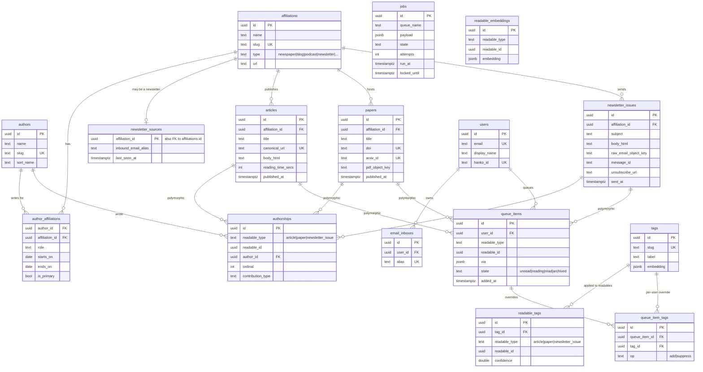

# Data Model

This is the schema v1 plans to ship. Tables are listed first, the
ER diagram follows, and then notes on the modeling decisions that
aren't obvious from the picture.

The schema lives in Postgres. Migrations are run by Migratus at
startup. Primary keys are UUIDs (`uuid`, generated via `gen_random_uuid()`).
Timestamps are `timestamptz`, default `now()`.

## Tables

### `authors`
The humans (or pseudonymous bylines) who wrote things.

| column      | type        | notes                                    |
| ----------- | ----------- | ---------------------------------------- |
| `id`        | uuid PK       |                                          |
| `name`      | text          | display name                             |
| `sort_name` | text NULL     | optional "Last, First" collation key     |
| `slug`      | text UK       | URL slug                                 |
| `bio`       | text NULL     |                                          |
| `created_at`| timestamptz   |                                          |
| `updated_at`| timestamptz   |                                          |

Notably: **no `email`, no `domain`, no `url`**. Most authors we ingest
will be people we never have direct contact details for. If an author
has a personal site, that's an affiliation, not a column on this table.

**`sort_name` is nullable on purpose.** Authors mostly arrive as a single
scraped byline string, and "First Last" → "Last, First" can't be inferred
reliably for mononyms, organizations, particles ("van", "de"), or
non-Western name orders. So `reader.domain.authors/create!` only derives a
sort key for *unambiguous* two-part names and leaves the rest NULL.
Ordering uses `COALESCE(sort_name, name)`, so a NULL just sorts by display
name — a fine default. A manually supplied `sort_name` always overrides
the heuristic.

TODO (UI, later): let the user edit `sort_name`, and surface authors whose
`sort_name` is NULL so they can fill one in for nicer surname-first
browsing.

### `affiliations`
Publications, blogs, podcasts, newsletters, employers, journals,
preprint servers -- any first-class *thing* an author can be associated
with.

| column        | type        | notes                                                                                          |
| ------------- | ----------- | ---------------------------------------------------------------------------------------------- |
| `id`          | uuid PK     |                                                                                                |
| `name`        | text        | "The Atlantic", "Stratechery", "arXiv"                                                         |
| `slug`        | text UK     |                                                                                                |
| `type`        | text        | enum: `newspaper`, `magazine`, `blog`, `podcast`, `newsletter`, `journal`, `preprint`, `other` |
| `url`         | text NULL   | canonical home page                                                                            |
| `description` | text NULL   |                                                                                                |
| `created_at`  | timestamptz |                                                                                                |
| `updated_at`  | timestamptz |                                                                                                |

### `author_affiliations`
Many-to-many between authors and affiliations.

| column           | type        | notes                                              |
| ---------------- | ----------- | -------------------------------------------------- |
| `author_id`      | uuid FK     | → `authors.id`                                     |
| `affiliation_id` | uuid FK     | → `affiliations.id`                                |
| `role`           | text NULL   | "writer", "editor", "host", "lead", …              |
| `starts_on`      | date NULL   |                                                    |
| `ends_on`        | date NULL   |                                                    |
| `is_primary`     | boolean     | which affiliation we display by default            |

Conceptually keyed on `(author_id, affiliation_id, starts_on)` so the
same author can have multiple discrete stints at the same publication.
A synthetic `id uuid` PK does the actual job because Postgres forbids
NULL in PK columns and `starts_on` is nullable; uniqueness on the
conceptual tuple is enforced via `UNIQUE NULLS NOT DISTINCT
(author_id, affiliation_id, starts_on)`.

### `newsletter_sources`
A 1:1 extension table on `affiliations` where `type = 'newsletter'`,
storing newsletter-specific state. Kept separate so the `affiliations`
table stays narrow.

| column                | type        | notes                                                                          |
| --------------------- | ----------- | ------------------------------------------------------------------------------ |
| `affiliation_id`      | uuid PK,FK  | → `affiliations.id`                                                            |
| `inbound_email_alias` | text NULL   | sender pattern (e.g. `@stratechery.com`) we use to recognize incoming issues   |
| `last_seen_at`        | timestamptz |                                                                                |

### Readables: three tables, not one

A "readable" is anything the user can put in their queue. The three
initial types are independent tables. They don't share a base table
because their fields diverge enough that a shared schema would be all
nullable columns.

#### `articles`
The web-page variety.

| column              | type        | notes                                        |
| ------------------- | ----------- | -------------------------------------------- |
| `id`                | uuid PK     |                                              |
| `affiliation_id`    | uuid FK NULL| publisher                                    |
| `title`             | text        |                                              |
| `slug`              | text        |                                              |
| `canonical_url`     | text UK     |                                              |
| `lang`              | text NULL   | BCP-47 code                                  |
| `abstract`          | text NULL   |                                              |
| `body_html`         | text NULL   | extracted reader-view HTML                   |
| `word_count`        | int NULL    |                                              |
| `reading_time_secs` | int NULL    |                                              |
| `published_at`      | timestamptz NULL |                                         |
| `created_at`        | timestamptz |                                              |
| `updated_at`        | timestamptz |                                              |

#### `papers`
Academic/preprint material.

| column           | type        | notes                                  |
| ---------------- | ----------- | -------------------------------------- |
| `id`             | uuid PK     |                                        |
| `affiliation_id` | uuid FK NULL| journal or preprint server             |
| `title`          | text        |                                        |
| `doi`            | text UK NULL|                                        |
| `arxiv_id`       | text UK NULL|                                        |
| `abstract`       | text NULL   |                                        |
| `published_at`   | timestamptz NULL |                                   |
| `pdf_object_key` | text        | key in the R2 bucket                   |
| `created_at`     | timestamptz |                                        |
| `updated_at`     | timestamptz |                                        |

#### `newsletter_issues`
One row per inbound newsletter email.

| column                  | type        | notes                                      |
| ----------------------- | ----------- | ------------------------------------------ |
| `id`                    | uuid PK     |                                            |
| `affiliation_id`        | uuid FK     | the newsletter (an `affiliation`)          |
| `subject`               | text        |                                            |
| `body_html`             | text        | cleaned-up HTML body                       |
| `sent_at`               | timestamptz |                                            |
| `raw_email_object_key`  | text        | key in the R2 bucket for the original .eml |
| `message_id`            | text NULL UK | email `Message-ID`; redelivery idempotency key (partial UNIQUE over present values) |
| `unsubscribe_url`       | text NULL   | `List-Unsubscribe` target, surfaced as a one-click link in the reader |
| `created_at`            | timestamptz |                                            |

### `authorships`
The bridge between readables and authors. Polymorphic on the readable
side: `readable_type` is `'article'` / `'paper'` / `'newsletter_issue'`,
`readable_id` is the matching primary key.

| column              | type        | notes                              |
| ------------------- | ----------- | ---------------------------------- |
| `id`                | uuid PK     |                                    |
| `readable_type`     | text        | discriminator                      |
| `readable_id`       | uuid        | not a FK; application-enforced     |
| `author_id`         | uuid FK     | → `authors.id`                     |
| `ordinal`           | int         | byline order                       |
| `contribution_type` | text NULL   | "primary", "co-author", "editor", …|

A composite index on `(readable_type, readable_id)` serves both the
"who wrote X" lookup and any type-filtered scan via prefix.

### `users`
End users of the reader. v1 supports a single self-hosted user, but the
schema is designed for multi-tenancy from the start.

| column         | type        | notes                                       |
| -------------- | ----------- | ------------------------------------------- |
| `id`           | uuid PK     |                                             |
| `email`        | citext UK   |                                             |
| `display_name` | text NULL   |                                             |
| `hanko_id`     | text UK NULL| subject identifier from Hanko               |
| `created_at`   | timestamptz |                                             |
| `updated_at`   | timestamptz |                                             |

### `email_inboxes`
The per-user inbound email alias(es) used for newsletter forwarding.
Aliases are random tokens — never derived from a display name or email
— so they're unguessable, don't leak identity to senders, and can be
rotated independently of the user.

| column     | type        | notes                                       |
| ---------- | ----------- | ------------------------------------------- |
| `id`       | uuid PK     |                                             |
| `user_id`  | uuid FK     | → `users.id`                                |
| `alias`    | text UK     | random token, e.g. `r-7f3a9b2c@reader.kira.is` |
| `created_at`| timestamptz|                                             |

### `queue_items`
The reading queue.

| column          | type        | notes                                                       |
| --------------- | ----------- | ----------------------------------------------------------- |
| `id`            | uuid PK     |                                                             |
| `user_id`       | uuid FK     | → `users.id`                                                |
| `readable_type` | text        | matches `authorships.readable_type`                         |
| `readable_id`   | uuid        | application-enforced                                        |
| `via`           | jsonb       | `{:source :email, :raw {…}}` — how this entered the queue   |
| `state`         | text        | enum: `unread`, `reading`, `read`, `archived`               |
| `added_at`      | timestamptz |                                                             |
| `started_at`    | timestamptz NULL |                                                        |
| `finished_at`   | timestamptz NULL |                                                        |

Unique constraint: `(user_id, readable_type, readable_id)` — the same
user can only have one queue item per readable.

Removing an item from the list is a soft archive (`state = 'archived'`):
the row stays and the shared readable is never touched. Because of the
unique constraint, re-adding the same readable reactivates the existing
row — `enqueue!` upserts, resetting it to `unread` — rather than
inserting a duplicate or erroring.

### `jobs`
Durable background work.

| column         | type        | notes                                                              |
| -------------- | ----------- | ------------------------------------------------------------------ |
| `id`           | uuid PK     |                                                                    |
| `queue_name`   | text        | `:ingest-email`, `:extract-pdf`, …                                 |
| `payload`      | jsonb       | job-specific args                                                  |
| `state`        | text        | `pending` / `in_progress` / `done` / `failed`                      |
| `attempts`     | int         |                                                                    |
| `last_error`   | text NULL   |                                                                    |
| `run_at`       | timestamptz | scheduled run time (now() for immediate)                           |
| `locked_until` | timestamptz NULL | held by a worker until this time                              |
| `created_at`   | timestamptz |                                                                    |
| `updated_at`   | timestamptz |                                                                    |

Workers do `SELECT ... FOR UPDATE SKIP LOCKED` to claim a job.

### Auto-tagging: `tags`, `readable_tags`, `queue_item_tags`, `readable_embeddings`

Topical tags inferred on ingest (see [the auto-tagging
section](architecture.md#auto-tagging)). `tags` is the shared vocabulary;
`readable_tags` is the intrinsic baseline (per readable, shared across users);
`queue_item_tags` is a per-user override delta on top.

#### `tags`
The shared tag vocabulary.

| column      | type        | notes                                                              |
| ----------- | ----------- | ------------------------------------------------------------------ |
| `id`        | uuid PK     |                                                                    |
| `slug`      | text UK     | normalized identity (lowercased, hyphenated)                       |
| `label`     | text        | display label (lowercased, ≤ 60 chars)                             |
| `embedding` | jsonb NULL  | the label's embedding (JSON array of floats), for near-dup folding |
| `created_at`| timestamptz |                                                                    |

#### `readable_tags`
The shared baseline: which tags the model assigned to a readable. Polymorphic on
the readable side (`readable_type` + `readable_id`), like `authorships`.

| column          | type        | notes                                                |
| --------------- | ----------- | ---------------------------------------------------- |
| `id`            | uuid PK     |                                                      |
| `tag_id`        | uuid FK     | → `tags.id` (cascade)                                |
| `readable_type` | text        | `article` / `paper` / `newsletter_issue`             |
| `readable_id`   | uuid        | application-enforced (polymorphic)                   |
| `source`        | text        | `llm` / `manual`                                     |
| `confidence`    | double      | the model's reported confidence (0–1)                |
| `created_at`    | timestamptz |                                                      |

Unique `(tag_id, readable_type, readable_id)`.

#### `queue_item_tags`
A per-user override: a sparse delta on the baseline, scoped to one queue item.

| column          | type        | notes                                                        |
| --------------- | ----------- | ------------------------------------------------------------ |
| `id`            | uuid PK     |                                                              |
| `queue_item_id` | uuid FK     | → `queue_items.id` (cascade)                                 |
| `tag_id`        | uuid FK     | → `tags.id` (cascade)                                        |
| `op`            | text        | `add` (pin a tag not in the baseline) / `suppress` (hide one)|
| `created_at`    | timestamptz |                                                              |

Unique `(queue_item_id, tag_id)`. A user's **effective** tags for an item are
`baseline ∖ suppressions ∪ additions`.

#### `readable_embeddings`
One embedding per readable, for "more like this" / recommendations (phase 2).
Populated now so the corpus needn't be reprocessed later.

| column          | type        | notes                                          |
| --------------- | ----------- | ---------------------------------------------- |
| `id`            | uuid PK     |                                                |
| `readable_type` | text        | polymorphic                                    |
| `readable_id`   | uuid        | application-enforced                           |
| `embedding`     | jsonb       | the readable's embedding (JSON array of floats)|
| `model`         | text NULL   | which embedding model produced it              |
| `created_at`    | timestamptz |                                                |

Unique `(readable_type, readable_id)`.

### `tagging_events`
Observability for the tag-readable job, shaped like `extraction_events` (not a
domain table): one row per attempt, with first-class metric columns plus a jsonb
`provenance` bag (proposed labels + vocab size) for offline evals.

| column          | type        | notes                            |
| --------------- | ----------- | -------------------------------- |
| `id`            | uuid PK     |                                  |
| `readable_type` | text        |                                  |
| `readable_id`   | uuid        |                                  |
| `outcome`       | text        | `done` / `failed` / `skipped`    |
| `error_class`   | text NULL   |                                  |
| `model`         | text NULL   |                                  |
| `tag_count`     | int NULL    |                                  |
| `duration_ms`   | int NULL    |                                  |
| `provenance`    | jsonb       | proposed labels + vocab size     |
| `created_at`    | timestamptz |                                  |

## ER diagram



## Modeling notes

### Why three readable tables, not one
See the principles doc, point 9. Articles, papers, and newsletter
issues have substantially different fields and substantially different
sources of truth. Putting them all in one `readables` table would force
many nullable columns and bury type-discrimination logic in application
code. With three tables, every type-specific query is a `SELECT *
FROM papers WHERE …`, every cross-cutting query is a `UNION` or a
domain function over typed inputs.

### Why affiliations are first-class
An affiliation is a noun with its own identity, URL, type, and
relationship to multiple authors and multiple publications. It outlives
any individual article. This is modeled as a table from the start to
accommodate authors who write for multiple outlets, which is most of them.
We get arbitrary outlets per author and arbitrary authors per outlet for free.

### Polymorphic references, not table inheritance
`authorships.readable_type` + `readable_id` is a polymorphic reference.
Postgres can't enforce it as a foreign key. The integrity check lives
in the application:

- inserts go through a domain function that validates the type/id pair
- the worker only writes types we know about
- a periodic reconciliation job *could* sweep for orphans, but in
  practice we never get them because every insert path is controlled

The alternative — three `authorships_*` tables — works but explodes
the join surface (an author's bibliography becomes a UNION across
three tables for every query). Polymorphic FK plus an
application-enforced check is the better trade.

### Why `via` is a jsonb blob
The way a readable got into the queue is meaningful context but doesn't
need to be queried structurally. We store it as `jsonb` so we can
add new source types without migrating. A queue item from email looks
like:

```json
{"source": "email", "alias": "r-7f3a9b2c@reader.kira.is",
 "from": "ben@stratechery.com", "subject": "…"}
```

one found via some other blog looks like:

```json
{"source": "https://some-blog.com"}
```

If a `via.source` value ever needs to be filtered on aggressively,
that's a sign to pull it out into a real column.

### Tags: shared baseline + per-user override

A tag describes the *content*, so the model-inferred baseline lives on the
readable (`readable_tags`), shared across every user who has it queued —
computed once. A user's own edits are a sparse delta on their queue item
(`queue_item_tags`): an `add` pins a tag the baseline lacks, a `suppress` hides
one it has. Effective tags resolve to `baseline ∖ suppressions ∪ additions`, so
re-tagging a readable (a better model, a re-ingest) propagates to everyone
automatically while each user's customizations stand.

### Embeddings as jsonb, not pgvector

Tag-label and readable embeddings are stored as `jsonb` arrays of floats and
compared with cosine similarity in Clojure, not in pgvector. The embedded
Postgres used in dev/test has no vector extension, so jsonb keeps dev, test, and
prod identical; and at this scale (a personal library) brute-force cosine is
sub-100ms — a vector index is unnecessary until tens of thousands of vectors.
The `tags.slug` identity is the stable hook to add a `vector` column later if
that day comes.

### Indexes (planned for v1)
- `authors(slug)` unique
- `affiliations(slug)` unique
- `affiliations(type)` for type-filtered listings
- `articles(canonical_url)` unique
- `papers(doi)` partial unique where not null
- `papers(arxiv_id)` partial unique where not null
- `authorships(readable_type, readable_id)` for "who wrote X"
- `authorships(author_id)` for "what has X written"
- `queue_items(user_id, state, added_at desc)` for the queue view
- `jobs(state, run_at)` where `state = 'pending'` for the worker poll
- `tags(slug)` unique
- `readable_tags(readable_type, readable_id)` and `(tag_id)`
- `queue_item_tags(queue_item_id)`
- `readable_embeddings(readable_type, readable_id)` unique
- `tagging_events(readable_type, readable_id)` and `(created_at desc)`
